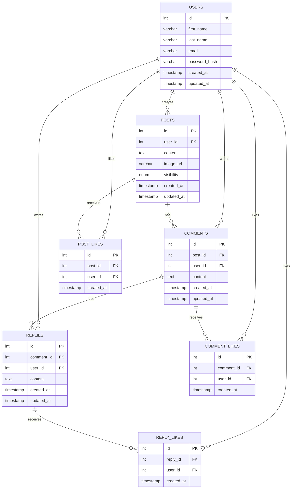

# Database ER Diagram — Social Media Feed App

## Entity Relationship Diagram

---

## Relationship Summary Table

| Relationship                 | Type        | Description                         |
|------------------------------|-------------|-------------------------------------|
| `USERS` → `POSTS`            | One-to-Many | A user can create many posts        |
| `USERS` → `COMMENTS`         | One-to-Many | A user can write many comments      |
| `USERS` → `REPLIES`          | One-to-Many | A user can write many replies       |
| `USERS` → `POST_LIKES`       | One-to-Many | A user can like many posts          |
| `USERS` → `COMMENT_LIKES`    | One-to-Many | A user can like many comments       |
| `USERS` → `REPLY_LIKES`      | One-to-Many | A user can like many replies        |
| `POSTS` → `COMMENTS`         | One-to-Many | A post can have many comments       |
| `POSTS` → `POST_LIKES`       | One-to-Many | A post can receive many likes       |
| `COMMENTS` → `REPLIES`       | One-to-Many | A comment can have many replies     |
| `COMMENTS` → `COMMENT_LIKES` | One-to-Many | A comment can receive many likes    |
| `REPLIES` → `REPLY_LIKES`    | One-to-Many | A reply can receive many likes      |

---

## Table Summary

| Table          | Primary Key | Foreign Keys                                      |
|----------------|-------------|---------------------------------------------------|
| USERS          | id          | —                                                 |
| POSTS          | id          | user_id → USERS                                   |
| COMMENTS       | id          | post_id → POSTS, user_id → USERS                  |
| REPLIES        | id          | comment_id → COMMENTS, user_id → USERS            |
| POST_LIKES     | id          | post_id → POSTS, user_id → USERS                  |
| COMMENT_LIKES  | id          | comment_id → COMMENTS, user_id → USERS            |
| REPLY_LIKES    | id          | reply_id → REPLIES, user_id → USERS               |

---

## Constraints & Key Notes

| Rule                  | Detail                                                         |
|-----------------------|----------------------------------------------------------------|
| Unique Like           | `UNIQUE(post_id, user_id)` in POST_LIKES                       |
| Unique Like           | `UNIQUE(comment_id, user_id)` in COMMENT_LIKES                 |
| Unique Like           | `UNIQUE(reply_id, user_id)` in REPLY_LIKES                     |
| Cascade Delete        | All FK → `ON DELETE CASCADE`                                   |
| Post Visibility       | `ENUM('public', 'private')` in POSTS                           |
| Feed Filter Query     | `WHERE visibility = 'public' OR user_id = :current_user_id`    |