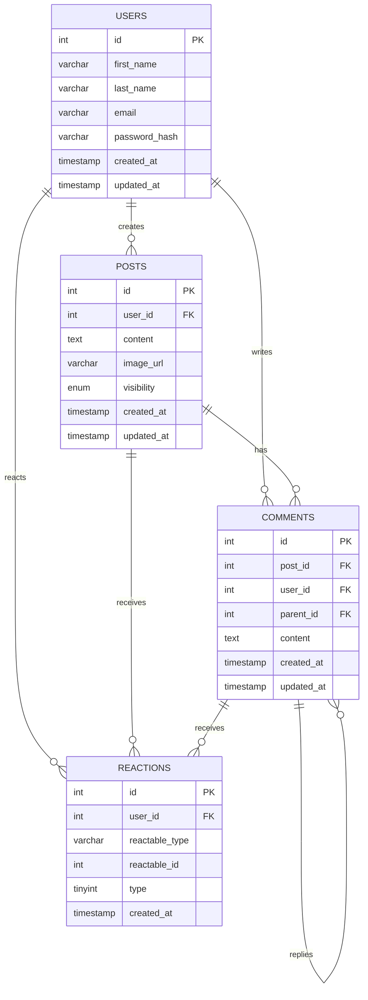

# Database ER Diagram — Social Media Feed App

## Entity Relationship Diagram

---

## Relationship Summary Table

| Relationship                 | Type        | Description                         |
|------------------------------|-------------|-------------------------------------|
| `USERS` → `POSTS`            | One-to-Many | A user can create many posts        |
| `USERS` → `COMMENTS`         | One-to-Many | A user can write many comments      |
| `USERS` → `REACTIONS`        | One-to-Many | A user can react to many targets    |
| `POSTS` → `COMMENTS`         | One-to-Many | A post can have many comments       |
| `POSTS` → `REACTIONS`        | One-to-Many | A post can receive many reactions   |
| `COMMENTS` → `COMMENTS`      | One-to-Many | A comment can have many replies     |
| `COMMENTS` → `REACTIONS`     | One-to-Many | A comment can receive many reactions |

---

## Table Summary

| Table          | Primary Key | Foreign Keys                                      |
|----------------|-------------|---------------------------------------------------|
| USERS          | id          | —                                                 |
| POSTS          | id          | user_id → USERS                                   |
| COMMENTS       | id          | post_id → POSTS, user_id → USERS, parent_id → COMMENTS |
| REACTIONS      | id          | user_id → USERS                                   |

---

## Constraints & Key Notes

| Rule                  | Detail                                                         |
|-----------------------|----------------------------------------------------------------|
| Unique Reaction       | `UNIQUE(user_id, reactable_type, reactable_id)` in REACTIONS   |
| Cascade Delete        | All FK → `ON DELETE CASCADE`                                   |
| Comment Threading     | `COMMENTS.parent_id` is `NULL` for top-level comments          |
| Post Visibility       | `ENUM('public', 'private')` in POSTS                           |
| Feed Filter Query     | `WHERE visibility = 'public' OR user_id = :current_user_id`    |
| Morph Map             | `reactable_type` uses `post` or `comment` aliases              |
| Reaction Types        | `0=dislike, 1=like, 2=love, 3=haha`                            |
